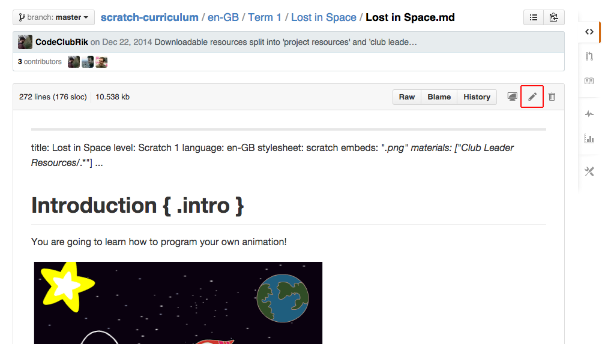
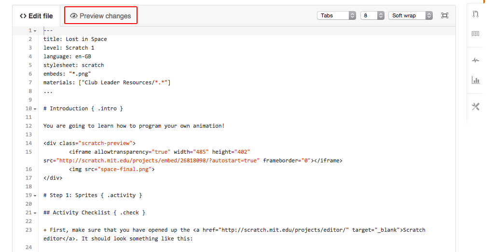

# Making Amendments to a Project
(these notes are under construction!)

## 0. Introduction

This guide explains how to make small amendments to a project. There are more notes for making bigger contributions, such as [adding new projects](PROJECTS.md) or [translating existing projects](TRANSLATING.md)

If you're amending a project and need additional support, you can email projects@codeclub.org.uk.

__To contribute a project to our curriculum, you'll need your own copy of the projects. There are instructions on how to do this in the main [contributing](CONTRIBUTING.md) notes.__

## 1. Edit a File

+ In the project repository, find the file you want to edit. Projects are separated by language.

+ Click 'edit'.

+ Make any changes. If you need additional help, there's a guide to [writing a project](projects.md). You can also click 'preview' to see your changes.

## 2. You're done!

Go back to the main notes on [contributing](contributing.md) to see how to upload your changes.
