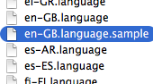

# Translating our Projects
(these notes are under construction!)

## 0. Introduction

This guide explains how to translate our projects into other languages.

If you're translating a project and need additional support, you can email projects@codeclub.org.uk.

__To contribute a project to our curriculum, you'll need your own copy of the projects. There are instructions on how to do this in the main [contributing](../contributing.md) notes.__

NOTE: you may only need to carry out some of these steps if no previous translations have been made for your language.

## 1. Create a copy of the project(s)

+ Make a copy of the folder called 'en-GB', containing the English language projects.
+ Rename this copied folder with the appropriate [language/country code](http://www.lingoes.net/en/translator/langcode.htm), for example 'es-ES' for Spanish. You can skip this step if a folder with this name already exists.

## 2. Translate the project(s)!

(__Note: New projects are labelled as 'New' for 6 weeks after they are uploaded. During this time, these projects may still be subject to small edits. Please wait until these projects are no longer labelled as 'New' before translating.__)

There's a guide to [writing a project](projects.md), which explains how to create each of the elements in the project instructions.

You can also generate [translated Scratch code](http://scratchblocks.codeclub.org.uk/translator/#script=when%20flag%20clicked%0Aforever%0A%20%20move%20(2)%20steps%0Aend&from=en&to=ru) from the English projects.

## 3. Update the manifest

+ Find the `.manifest` file for the project(s) you've translated. Rename the 'en-GB' portion of the filename with your language/country code.


+ If the project and/or folder names have also been translated, open the manifest file and update this information. Here's an example:

```
        {
            "filename": "Rock Band/Rock Band.md",
            "number": 1
        }
```

+ You should also make sure that the correct language is specified at the top of the file, and you can also provide translated titles and descriptions.

```
    "id": "scratch",
    "title": "Iniciación a Scratch",
    "description": "Scratch es una forma sencilla y divertida de programar arrastrando bloques y colocándolos juntos",
    "language": "es-ES",
    "number": 1,
```

## 4. (Optional) Add a `.language` file

You can also provide translated text for various website links and project instructions. Do do this, you'll need to clone the [lesson_format](https://github.com/CodeClub/lesson_format) repository. This repository is used to build the projects website from Scratch, HTML & CSS and Python repositories. There are instructions on how to do this in the main [contributing](contributing.md) notes.

+ In the 'lesson_format' repository, go to the 'assets/languages' folder, and find the file called `en-GB.language.sample`:



+ If a `.language` file doesn't already exist for your language, copy this file and rename it with your language/country code. You should also remove the `.sample` portion of the filename.

+ Open the copied file in a text editor and provide the various translations:

```
	"code": "Language code e.g. en-GB",
	"name": "Language name e.g. English",
	"translations": {
		"Download PDF": "Your translation here!",
		"Download Project Materials": "Your translation here!",
		"Extras": "Your translation here!",
		...
```

## 5. You're done!

Go back to the main notes on [contributing](../contributing.md) to see how to upload your new project(s).
