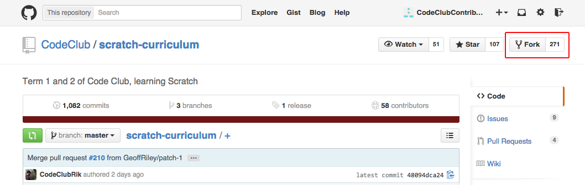
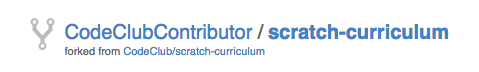
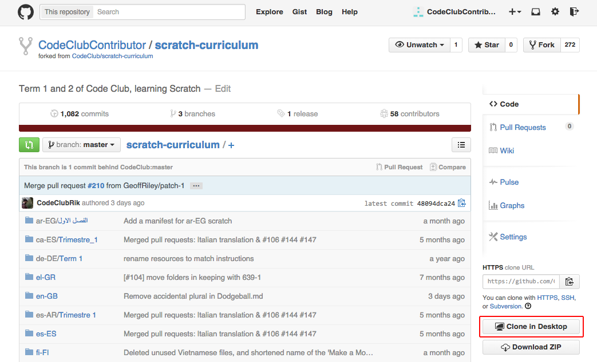
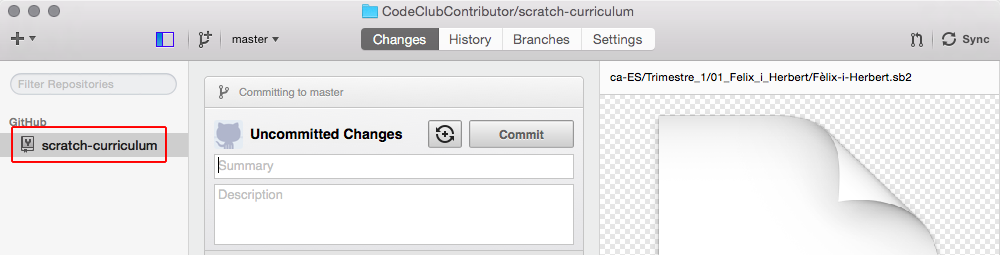
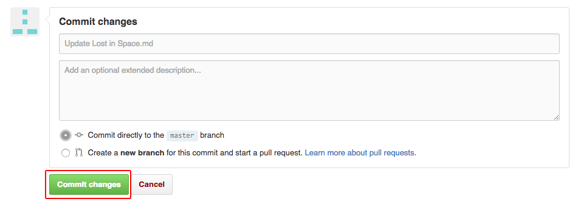
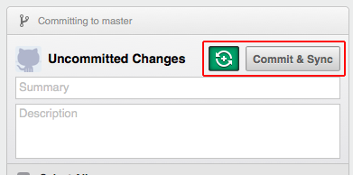
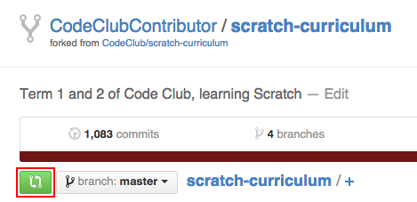
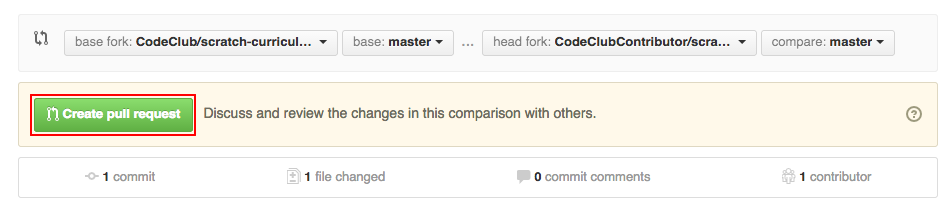

# Contributing to our Curriculum
(these notes are under construction!)

## 0. Introduction

This guide explains how to contribute to our curriculum. You can:
+ Suggest amendments and improvements to our projects;
+ Write new projects;
+ Translate our projects into other languages.

We recommend using [GitHub](https://github.com/) to contribute. GitHub is a version-control system that allows hassle-free contributions, and allows us to easily track and manage those contributions. These notes outline the process of contributing via GitHub.

If you don't have a GitHub account, you can [sign up](https://github.com/join). You can also install the GitHub application, which is available for [windows](https://windows.github.com/) or [mac](https://mac.github.com/).

You don’t have to use GitHub to contribute. If you prefer, you can also email us with your contribution at projects@codeclub.org.uk.

Alternatively, you can click the following links to raise an issue with our [Scratch](https://github.com/CodeClub/scratch-curriculum/issues), [HTML & CSS](https://github.com/CodeClub/webdev-curriculum/issues) or [Python](https://github.com/CodeClub/python-curriculum/issues) curriculum. If you have any cool ideas for improving our curriculum (or our website), you can [submit your idea to us](https://github.com/CodeClub/ideas/issues).

## 1. Create a copy of the projects

Each curriculum has its own repository, which is a central place for storing all of the projects. The files in the repositories are used to generate the websites for the [UK](http://projects.codeclub.org.uk) and [world](http://projects.codeclubworld.org) project sites.

Click the link for the repository you wish to contribute to. We currently have [Scratch](https://github.com/CodeClub/scratch-curriculum), [HTML & CSS](https://github.com/CodeClub/webdev-curriculum) and [Python](https://github.com/CodeClub/python-curriculum) project repositories.

Click the 'Fork' button to create your own copy of the projects repository. This will enable you to make changes to the projects.



If the copied repository shows your own username (and the text 'forked from CodeClub') then you've successfully created a fork (copy) of the curriculum.



(If you are only making small text edits to projects, you can jump to step 3.)

## 2. Downloading the projects

__This step is not neccessary for small text edits to the projects.__

Clone the repository to your computer. This will create a copy of your new repository on your local computer.

If you're using the GitHub tool for Mac or Windows, click 'clone' to download the repository to your computer.



If the clone has been successful, you should see the repository in the GitHub application.



Alternatively, if you don't have the GitHub application, you can type the following from the terminal:

```
cd ~/Documents
git clone git@github.com:YOUR_NAME/REPOSITORY_NAME.git
```

Note: Replace YOUR_NAME with your GitHub username, 'Documents' with the name of the folder you'd like to save the repository into, and REPOSITORY_NAME with the name of the repository. This will be one of the following:

+ scratch-curriculum
+ webdev-curriculum
+ python-curriculum

Make sure that you have configured your fork to sync with the original. The instructions to do this can be found [on the GitHub help website](https://help.github.com/articles/configuring-a-remote-for-a-fork).

```
git remote add upstream https://github.com/CodeClub/scratch-curriculum.git
```

In the command above you will need to replace the word `scratch` with `webdev` or `python` if you are forking a different repository.

## 3. Make your contribution

You can now:
+ [Make amendments and improvements to projects](amending.md);
+ For the projects.codeclubworld.org site:
  + [Write new projects](ccw/projects.md);
  + [Translate our projects into other languages, including screenshots](ccw/translating.md).
+ For the codeclubprojects site:
  + [Write new projects](ccp/projects.md).

When contributing to our curriculum, please make sure that the project conforms to our [project guidelines](project-guidelines.md).

## 4. (Optional) View your contribution

To view your contribution, you'll need to use the [lesson_format](https://github.com/CodeClub/lesson_format) tool to build a local copy of our projects. Instructions on how to install the lesson formatter are [here](https://github.com/CodeClub/lesson_format/blob/master/README.md).

## 5. Save your contribution

For small changes made directly on the GitHub website, you can simply scroll down to the bottom of the file you've amended, and click 'Commit Change'.



For new projects and translations, the contributions you've written are saved to your local computer, but you'll need to upload them to your GitHub account. Here's how you upload your contribution:

Before saving your contribution to your fork, ensure that your fork is up to date with Code Club's original repository. Instructions on how to do this are [on the GitHub help website](https://help.github.com/articles/syncing-a-fork).

```
git fetch upstream
git merge upstream/master
```

If you're using the GitHub for Mac or Windows application, click the 'toggle' button, so the button on the right says 'Commit and Sync'. Then click this button to upload your contribution. You'll need to add a summary and a description of your contribution.



If you're not using the GitHub application, from the terminal go to the root folder of your repository, for example:

```
cd ~/Documents/scratch-curriculum
```

+ Add in your files.

```
git add --all
```

+ Commit your contribution:

```
git commit -m 'Your message here'
```

+ Push your contribution to your GitHub account.

```
git push
```

## 6. Merge your contribution with our curriculum

Go to your copy of the respository on the GitHub website, and click the 'Pull Request button.



On the next screen, you can review your changes, and click the 'Create pull request' button if you're happy, which will alert us to your contribution.



If you've translated a project (or projects), give another native speaker a link to your pull request, which will be something like http://github.com/codeclub/scratch-curriculum/pull/3. If they’re happy, they should leave a comment on the pull request with a :+1: or similar message.

When we merge the pull request, your contribution will become part of the main curriculum repository, available for everyone to use and benefit from!
