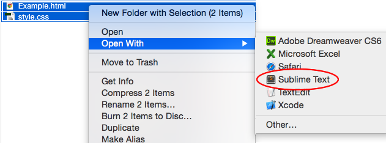
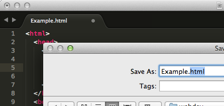
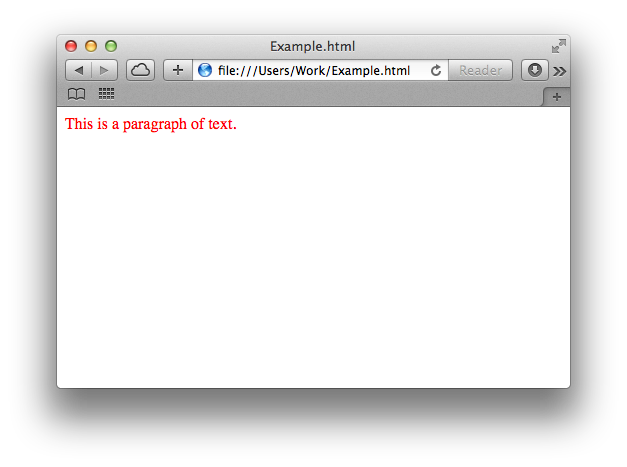
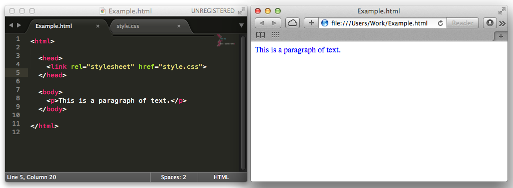

### What is HTML?

...

### Coding in HTML

...

### What is CSS?

...

### Coding in CSS

...

### Using Trinket

...

### Working Offline

When completing our HTML & CSS projects, we recommend using [Trinket](https://trinket.io) to build webpages online. Trinket offers several advantages over using a text editor offline:

+ Children can see a live preview of their HTML & CSS code;
+ Children can save their code online, allowing them to access their webpages both within their club and at home;
+ Children can share their webpages with others, and can remix webpages shared with them.

However, there may be times when children in your club will need to write HTML & CSS code offline. The following is a short guide to writing, editing and viewing HTML & CSS offline.

###### Writing

Each project's downloadable resources includes the following files:

+ Example.html
+ style.css

Make sure that these files (as well as any images) are in the same folder. (If you want to write your own HTML, you can download the template webpage documents in the 'Project Resources' for each HTML project.)

Open both of these files in a text editor. We recommend [Sublime Text 3](http://www.sublimetext.com/3), but there are loads of other good editors available. The easiest way to open both the `.html` and `.css` files for your webpage is to highlight both files and right-click to open them in a text editor.

###### Saving

After writing your HTML & CSS, save your files - making sure that the files have `.html` and `.css` file extensions.

###### Viewing

To view a webpage, double-click the `Example.html` file to open it in a browser.

If your HTML file opens in a text editor, make sure that it has a `.html` file extension.

The easiest way to view changes is to open your files in a browser _and_ a text editor. You can then make changes in the text editor, save the file and then click 'refresh' in the browser to see your changes.

### Further Resources

...
